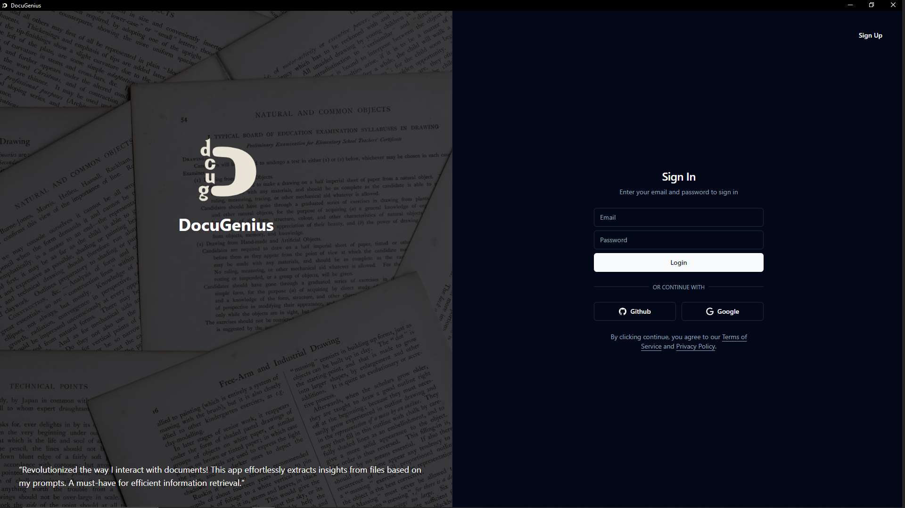
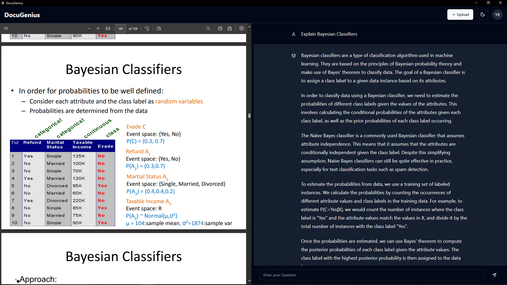

DocuGenius - A Revolutionary Document Analysis and Question Answering Tool
============================================================================

Overview
--------

DocuGenius is a cutting-edge desktop application that enables users to upload any type of document and ask questions related to its contents. The app uses the powerful Pinecone vector database and OpenAI API to provide accurate and relevant answers. With its innovative embedding and vector search technology, DocuGenius is capable of delivering lightning-fast responses to user queries.

Screenshots
-----------

Features
--------

### Upload and Analyze Documents

Users can upload various types of documents, such as PDFs, Word documents, and text files, to DocuGenius. The app's sophisticated algorithms will then analyze the contents of the document, extracting relevant information and creating a unique embedding.

### Ask Questions and Get Accurate Answers

Users can ask questions related to the contents of the uploaded document using DocuGenius' intuitive interface. The app utilizes OpenAI's robust natural language processing capabilities to understand the context of the question and provide relevant answers. The answers are generated by searching for the top 3 embeddings that match the user's query.

### Embedding and Vector Search

DocuGenius creates a unique embedding for each document, which captures the essence of its contents. The app's backend, powered by ChatGPT-retrieval-plugin server, leverages the Pinecone vector database to perform vector searches. This advanced technology enables DocuGenius to quickly identify and retrieve the most relevant information from the document.

### User-Friendly Interface

DocuGenius boasts a user-friendly interface built using Tauri, ReactJS, Tailwind CSS, and Shadcn/UI. The frontend's clean design and intuitive layout make it easy for users to navigate the app and get the most out of its features.

### Robust Backend

The backend of DocuGenius is built using ExpressJS, MongoDB, and ChatGPT-retrieval-plugin server. This robust infrastructure ensures that the app can handle a large volume of user requests and document analysis tasks with ease.

---------------

Contributing
------------

We welcome contributions from the community to help improve DocuGenius. If you're interested in contributing, please fork the repository and submit your changes as a pull request.

License
-------

DocuGenius is licensed under the MIT License - see the LICENSE.md file for details.

Acknowledgments
---------------

Many thanks to the following projects and organizations for their contributions to the development of DocuGenius:

* Pinecone vector database (<https://pinecone.io/>)
* OpenAI (<https://openai.com/>)
* ChatGPT-retrieval-plugin (<https://github.com/openai/chatgpt-retrieval-plugin>)
* Tauri (<https://tauri.app/>)
* ReactJS (<https://reactjs.org/>)
* Tailwind CSS (<https://tailwindcss.com/>)
* Shadcn/UI (<https://ui.shadcn.com/>)
* ExpressJS (<https://expressjs.com/>)
* MongoDB (<https://www.mongodb.com/>)
* test

We are grateful for the opportunity to build upon their work and create a revolutionary document analysis and question answering tool.
